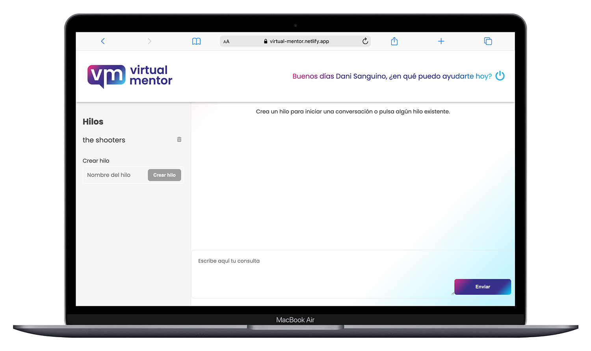

# Virtual Mentor Assistant (Beta)




Virtual Mentor Assistant is an online AI-powered assistant built with OpenAI, featuring RAG (Retrieval-Augmented Generation) capabilities. It extracts structured information from PDF documents and uses it to enhance user interactions. The project includes user authentication, conversation management, and a fully responsive frontend.

🚀 Try the beta version: [https://virtual-mentor.netlify.app/](https://virtual-mentor.netlify.app/)

---

## ✨ Features

- **OpenAI Integration** – Conversational assistant powered by OpenAI models.
- **RAG System** – Uses structured JSON data extracted from PDFs to improve answers.
- **PDF to JSON Conversion** – Script-based processing to generate data from documents.
- **User Authentication** – Secure login via Firebase Authentication.
- **Conversation History** – Saves and retrieves user interactions.
- **React + Vite Frontend** – Fast and modern development stack.
- **pnpm** – Efficient dependency management.
- **TypeScript** – Full type safety across the codebase.
- **SASS with BEM** – Maintainable and scalable CSS using BEM methodology.

---

## 🛠️ Getting Started

Clone the repository:

```bash
git clone https://github.com/danisanguino/virtual-mentor-frontend.git
```

Install dependencies:

```bash
pnpm install
```

Run the development server:

```bash
pnpm run dev
```

---

## 🔐 Authentication & Data

Firebase handles user registration, login, and session management.

User conversations are stored securely and can be retrieved per session.

---

## 📄 PDF to JSON Script

The project includes a custom script that processes PDF files and transforms them into structured JSON format. This structured data is used by the assistant to provide contextually relevant and accurate responses.

---

## ⚙️ Environment Variables

For security reasons, environment variable values are not included in the repository.

To run the project locally:

1. Create a `.env` file in the root directory.
2. Copy the contents of `.example.env` as a template.
3. Fill in your own API keys and credentials for:
   - **OpenAI API**
   - **Firebase Configuration**

This step is required for the app to connect to the AI services and database properly.

---